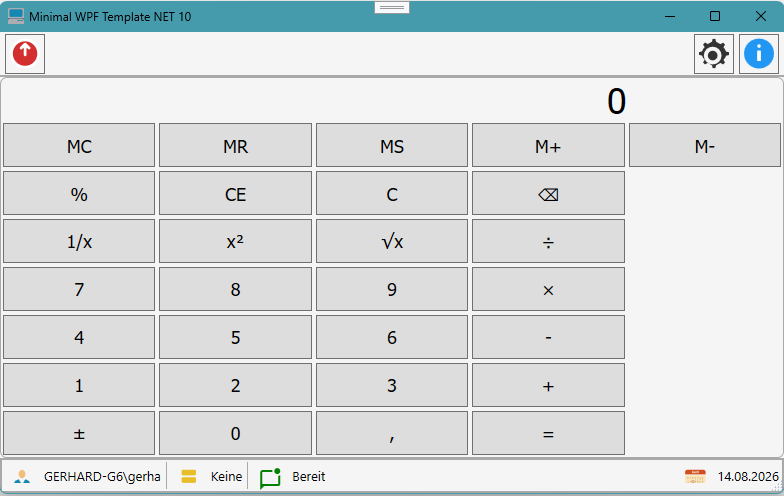
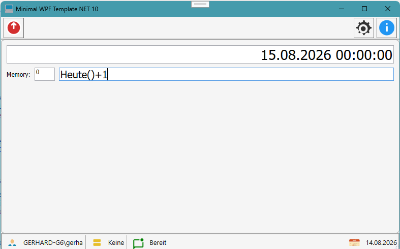
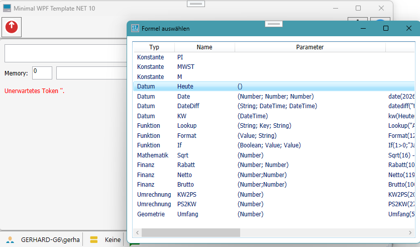
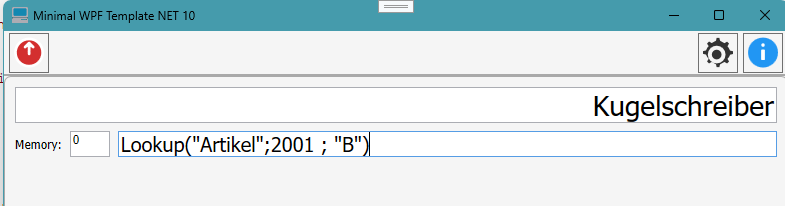

# Calculator Projekt


# Projekt
Dieses Demo dient dazu eine UserControl mit einem Rechner zu erstellen, der einen Mode als klassischen Taschenrechner aber umgeschaltet auf einen Rechner mit einer Expression Eingabezeile. Die Rechenfunktionen sind erweiterbar. 

## GUI Classic Calculator



## GUI Expression Calaculator



### Tokenizer


### Expression Parser


### CalculatorEngine

## Funktionsauswahl für den Expression Calaculator




## Sonderfunktion Lookup
Die Lookup Funktion ist keine klassische Funktion wie Datum oder Umrechnung. Die LookupFuktion benötigt eine Datenquelle (in das Projekt fest als DataTable eingebaut) um Auswertungen durchführen zu können.



```csharp
/* Laden von Daten zur Lookup-Auswertung*/
DataTable dtKunden = LadeKunden();
DataTable dtArtikel = LadeArtikel();
DataTableLookupProvider provider = new();
provider.Add("Kunden", dtKunden, "A");
provider.Add("Artikel", dtArtikel, "A");

var lookupFunction = new LookupFunction
{
    Provider = provider
};

this._functionRegistry.Register(lookupFunction);

_evaluator = new Evaluator(this, _functionRegistry);

```
Im Beispiel ist der Provider auf ein DataTabele ausgelegt, es ist aber auch eine beliebige andere Datenquelle denkbar.


- Erste Erstellung Version vom 22.07 2026
